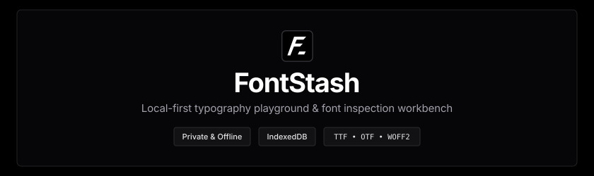

<div align="center">
  
</div>

<p align="center">
  <a href="https://nextjs.org"></a>
  <a href="https://react.dev"></a>
  <a href="https://tailwindcss.com"></a>
  
  
</p>

A local-first, private typography studio and font workbench. Drop font files directly into the browser or `public/fonts` to instantly inspect, compare, and test typefaces offline with zero cloud uploads.

---

## Highlights

- **Binary Font Metadata Parsing**: Deep font metadata extraction for authentic designer, manufacturer/foundry, copyright, license, glyph count, units per EM, weight class, and version information.
- **Drag & Drop Sandbox**: Drop TTF, OTF, WOFF, or WOFF2 files anywhere in the window for client-side ingestion stored safely in private IndexedDB storage.
- **Deep Specimen Inspector**: Size waterfall, interactive glyph wall with click-to-copy hex codes, editorial layout testing, and technical metadata tables.

---

## Tech Stack

- **Framework**: Next.js 16 + React 19
- **Styling**: Tailwind CSS v4
- **Icons**: Phosphor Icons (`@phosphor-icons/react`)

---

## Quick Start

### Prerequisites
- Node.js 20+
- pnpm

### 1. Install dependencies
```bash
pnpm install
```

### 2. Start development server
```bash
pnpm dev
```

### 3. Open in browser
Visit [http://localhost:3000](http://localhost:3000). Drop font files directly into the browser or add them to `public/fonts`.

---

<p align="center"><em>Built with precision for type lovers and font engineers</em></p>
